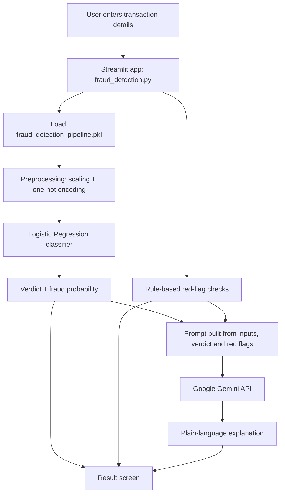

# 🛡️ Bank Fraud Detection System

A web app that checks a bank transaction, predicts whether it is **fraud or not fraud**, shows a **fraud probability**, and uses **Google Gemini** to explain the result in plain language.

🔗 **Live demo:** 
https://bankfraud.streamlit.app/ 
---

## ✨ Features

- Predicts **FRAUD / NOT FRAUD** from transaction details
- Shows a **fraud probability** bar and metric cards
- Rule-based **red flags** (account emptied, balance mismatch, zero-balance receiver, etc.)
- **Gemini AI explanation**: what kind of fraud it resembles, why the model decided so, and what to do next
- Free to host on Streamlit Community Cloud

---

## 🧠 How it works (in simple words)

Think of the app as a small shop:

| Shop idea | In this project |
|---|---|
| Shopfront (what customers see) | `fraud_detection.py` (Streamlit screen) |
| Expert in the back room | `fraud_detection_pipeline.pkl` (trained model) |
| Report writer | Google Gemini (explains the decision) |
| Safe | Streamlit Secrets (holds the API key) |

The customer enters a transaction at the shopfront, the expert decides, and the report writer explains the decision in everyday words.

---

## 🏗️ Architecture



### Model pipeline

1. **Data:** bank transactions dataset from Kaggle
2. **Exploration & cleaning:** done in `analysis_model.ipynb`
3. **Preprocessing:** `StandardScaler` for numbers, `OneHotEncoder` for transaction type
4. **Model:** `LogisticRegression(class_weight="balanced")` because fraud is rare
5. **Saved as:** one scikit-learn `Pipeline` using `joblib` (`fraud_detection_pipeline.pkl`)

### Inputs the model expects

| Field | Meaning |
|---|---|
| `type` | PAYMENT, TRANSFER or CASH_OUT |
| `amount` | Transaction amount |
| `oldbalanceOrg` | Sender balance before |
| `newbalanceOrig` | Sender balance after |
| `oldbalanceDest` | Receiver balance before |
| `newbalanceDest` | Receiver balance after |

> Because the model uses balanced class weights, the probability is best read as a "suspicion level" rather than an exact chance of fraud.

---

## 🛠️ Tech stack

Python · Pandas · NumPy · scikit-learn · joblib · Matplotlib · Seaborn · Streamlit · Google GenAI (Gemini)

---

## 📁 Project structure

```
fraud-detection-app/
├── fraud_detection.py              # Streamlit app (front end + Gemini call)
├── fraud_detection_pipeline.pkl    # Trained model pipeline
├── requirements.txt                # Libraries to install
├── .gitignore                      # Keeps secrets out of GitHub
├── README.md                       # This file
├── notebook/
│   └── analysis_model.ipynb        # Data analysis and model training
└── .streamlit/
    └── secrets.toml                # Gemini key (LOCAL ONLY, never uploaded)
```

---

## 🚀 Run locally

**1. Clone the repo**
```bash
git clone https://github.com/YOUR-USERNAME/fraud-detection-app.git
cd fraud-detection-app
```

**2. Install libraries**
```bash
pip install -r requirements.txt
```

**3. Get a free Gemini API key** from [Google AI Studio](https://aistudio.google.com).

**4. Add the key.** Create `.streamlit/secrets.toml`:
```toml
GEMINI_API_KEY = "your-key-here"
```

**5. Start the app**
```bash
streamlit run fraud_detection.py
```

---

## ☁️ Deploy free on Streamlit Community Cloud

1. Push the project to a **public GitHub repo** (do **not** upload `secrets.toml`).
2. Go to [share.streamlit.io](https://share.streamlit.io) and sign in with GitHub.
3. Click **Create app** → **Deploy a public app from GitHub**.
4. Set **Repository** to your repo, **Branch** to `main`, **Main file path** to `fraud_detection.py`.
5. Open **Advanced settings → Secrets** and paste:
   ```toml
   GEMINI_API_KEY = "your-key-here"
   ```
6. Click **Deploy** and wait a few minutes. Your app gets a public link.

Any change you commit to GitHub redeploys the app automatically.

---

## 🧪 Try these examples

| Case | Type | Amount | Sender old → new | Receiver old → new | Expected |
|---|---|---|---|---|---|
| Normal payment | PAYMENT | 1,000 | 10,000 → 9,000 | 0 → 0 | Not fraud |
| Suspicious transfer | TRANSFER | 50,000 | 50,000 → 0 | 0 → 0 | Likely fraud |

---

## 🩹 Troubleshooting

| Problem | Fix |
|---|---|
| `ModuleNotFoundError` | Add the missing library to `requirements.txt` and push again |
| Error loading the `.pkl` | Pin the same scikit-learn version used for training, e.g. `scikit-learn==1.5.1` |
| "Gemini API key not set" | Check the key in `secrets.toml` (local) or Settings → Secrets (cloud) |
| First load is slow | The free tier sleeps when unused; wait a few seconds |

---

## ⚠️ Limitations

- Trained on a public dataset, so it is a learning project and **not for real banking decisions**
- Gemini's explanation is based only on the data shown and can be wrong
- Free-tier limits apply to both Streamlit Cloud and the Gemini API

---

## 🔮 Future improvements

- Batch mode: upload a CSV and check many transactions
- Chart showing which inputs pushed the prediction toward fraud
- Try other models (Random Forest, XGBoost) and compare

---

## 👤 Author

CH VISHAL
